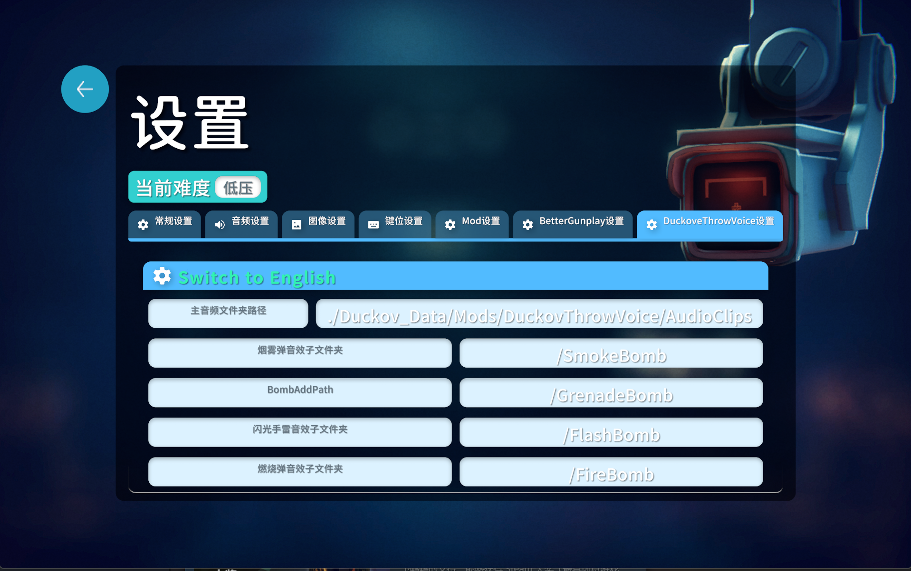
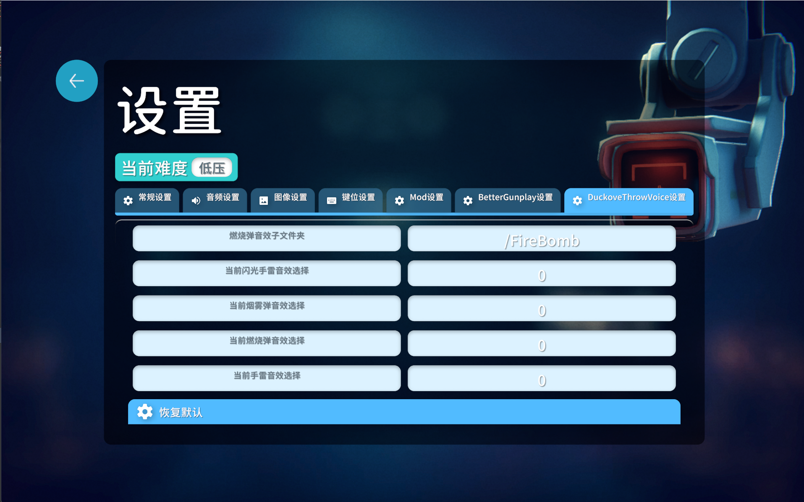

# Duckov-DuckovThrowVoice

This is a game mod about Duckov to change it Throw voice. 一个简单的逃离鸭科夫的Mod,为游戏添加投掷的音效
---

## 开源引用库声明:
    本模组的UI及其Setting设置部分从 BetterGunPlayMod 的源代码改写实现
    BetterGunPlayMod 的代码仓库地址:[链接](https://github.com/imtyg/Duckov_betterGunplay#)  作者为:p16531749-spec

---

## 简介
    DuckovThrowVoice为所有游戏本体中的投掷物品添加投掷时的音效
    分为4类:手雷,闪光弹,燃烧弹,烟雾弹
    可以自行设置读取的文件夹路径和索引读取不同文件
    支持音频格式包括: .wav, .mp3, .ogg

---

## 代码仓库结构
    源代码在"DuckovThrowVoiceSource"文件夹中
    编译后的Mod文件方在"DuckovThrowVoiceMod"文件夹中

---

## 读取文件结构
- FileChips **总主音频文件夹**
    - SmokeChips **烟雾弹音频子文件夹**
        - Smoke1.wav **烟雾弹音频文件mp3**
            - Smoke2.mp3 **烟雾弹音频文件wav**
            - Smoke3.ogg **烟雾弹音频文件ogg**
            - ......
    - FireChips **燃烧弹音频子文件夹**
        - ......
    - GrenadeChips **手雷音频子文件夹**
        - ......
    - FlashChips **闪光弹音频子文件夹**
        - ......

---

## 如何自己构建:
    1.获取源代码: `git clone git@github.com:rain-chemms/Duckov-DuckovThrowVoice.git`
    2.下载并安装Visual Studio 2022 Community
    3.配置项目输出的文件路径
    4.点击"生成"->"Build DuckovThrowVoice" 或者 Ctrl + B
    5.在编译后的,目录如Debug//netstandard2.1中寻找DuckovThrowVoice.dll
    6.进入游戏本体的Mod文件夹下,创建DuckovThrowVoice文件夹
    7.将DuckovThrowVoice.dll + preview.png + info.ini + AudioChips复制到DuckovThrowVoice文件夹中

---

## 依赖以及C#版本要求
- .NET Standard 2.1
    - C# 9.0及以上
    - harmony库:haramony.dll
    - 音频库:FMODUnity.dll
    - 开源项目BetterGunPlayMod包含的依赖项

---

## 项目配置文件:  

<Project Sdk="Microsoft.NET.Sdk">

  <PropertyGroup>
    <TargetFramework>netstandard2.1</TargetFramework>
    <LangVersion>9.0</LangVersion> 
	<Nullable>enable</Nullable>

      <!-- For Windows users, please fill the folder path which contains Duckov.exe below -->
      <!-- Windows 用户请在下面这行填写你的鸭科夫安装路径（包含 Duckov.exe 的目录），这样编译器就能找到相关的 dll 文件 -->
      <DuckovPath>E:\Steam\steamapps\common\Escape from Duckov</DuckovPath>

        <SubPath>\Duckov_Data\Managed\</SubPath>

        <BaseOutputPath>D:\PROJECT\C#\逃离鸭科夫投掷音效\ReleaseMod\DuckovThrowVoice</BaseOutputPath>
    </PropertyGroup>
	
	<ItemGroup>
        <Reference Include="$(DuckovPath)$(SubPath)TeamSoda.*" />
        <Reference Include="$(DuckovPath)$(SubPath)ItemStatsSystem.dll" />
        <Reference Include="0Harmony">
          <HintPath>0Harmony.dll</HintPath>
        </Reference>
        <Reference Include="FMODUnity">
          <HintPath>FMODUnity.dll</HintPath>
        </Reference>
        <Reference Include="HarmonyLoadMod">
          <HintPath>HarmonyLoadMod.dll</HintPath>
        </Reference>
        <Reference Include="$(DuckovPath)$(SubPath)Unity*" />
    </ItemGroup>
</Project>